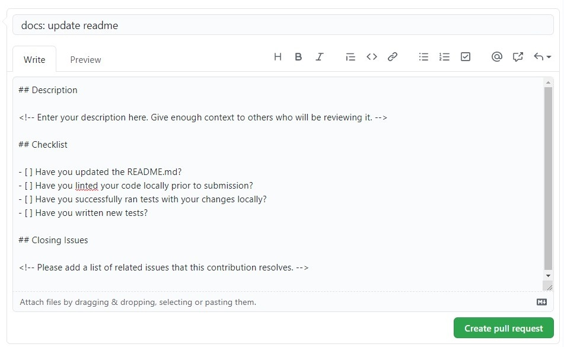
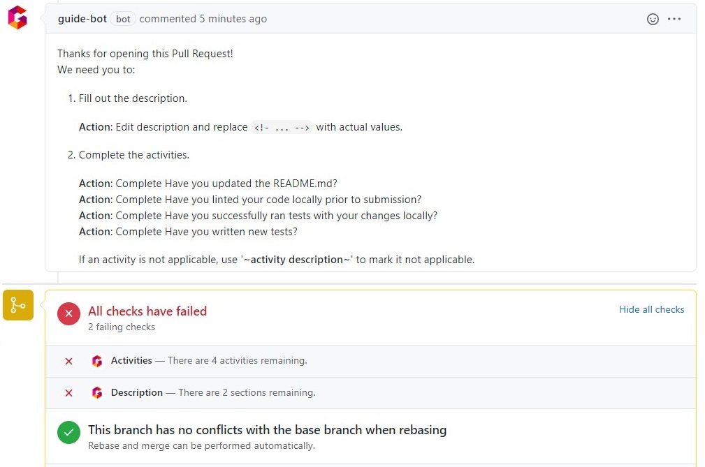
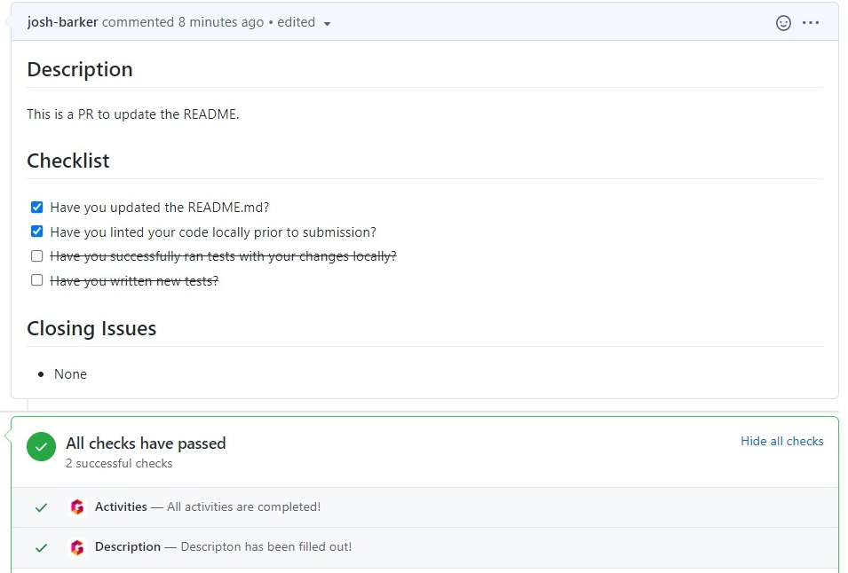
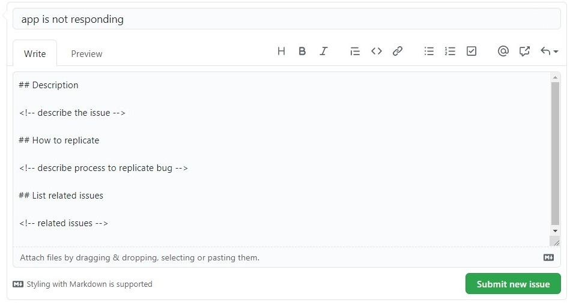
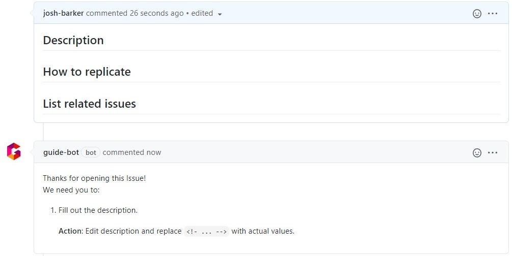
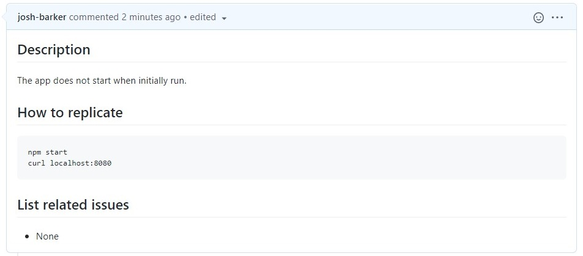

# Guide Bot

The Guide Bot encourages all contributors to fill and do all the activities for an Issue and Pull Request.

## Issue and Pull Request Templates

In Github, you can setup a template to ask people to enter details to help the maintainers.

- It's common to use HTML comments, for example `<!-- enter your description here -->`, to ask people fill in details.
- Checklists are another common way to prompt contributors to do particular activities.

The bot will ask people to do both of those things via a comment.

In a PR, it will also add a status showing what is left to do.

If there's nothing to do, no comment will be shown.

## PR Example

### Creating a new PR

### Bot Response to PR

### Contributor updated body and completed activities

- The comment is deleted from the issue, as there is nothing else to do.
- The status checks are updated to success.

---

## Issue Example

### Creating a new Issue

### Bot Response

### Contributor updated body

The comment is deleted from the issue, as there is nothing else to do.

